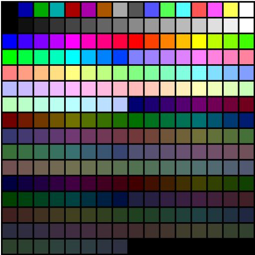

# UNDERSTANDING 8-BIT GRAPHICS :)

To start, let's understand what is meant when talking about 8-bit graphics.  

When video game consoles were first created in the 70s, the processors were naturally not as advanced as the processors used nowadays. Any new computer these days runs on a 64-bit processing system. In the 80s, the first computer to run on a 32-bit processor was released however, due to their smaller size, game consoles were limited to 8-bit.

The term '8-bit' is often misused but what it means in this case is that the memory capacity of these processors was VERY low and could store very limited information - hence the low quality in graphics and pixelated look all video games had at that time.
 

## LET'S START FROM THE BASICS..
### what are these 'bits' you speak of?
The term '***bit***' is short for '**binary digit**'.  
Each 'bit' represents *a place to store information*. To make this short and sweet, a binary digit can either be a 0 or a 1. Think of it as a light switch, when the 'bit' is set to 0 it's essentially 'off'. When the 'bit' is set to 1, it is on.

### Now to understand the maths behind it:  
It runs on the basis of 2n :  
*(n being the number in front of the bit)*  

***1-bit*** *(aka 21)* has 2 possible states - 0 and 1.  
***2-bit*** *(22)* has 4 possible states - 00, 01, 10, 11.  
***4-bit*** has 16 - 0000, 0001, 0010, 0011, 0100, 0101, 0110, 0111, 1000, 1001, 1011, 1010, 1100, 1101, 1110, 1111.  
***8-bit*** has 256 possible states - which i'm not going to list out (for obvious reasons).

Essentially, this means that any game console running on 8-bit has 256 possible units to store information.   

    

## Let's imagine this as a grid:
an 8-bit grid is 16 by 16 units.  

Each individual unit in this grid stores a single piece of information and when dealing with 8-bit video games (such as the first Mario Bros on Nintendo's first console - NES) this grid was used for the colour palette and for 'tile' design - which I'll cover in a bit (pun not intended). Only 256 colours, and 256 tile designs, could be used within the entire game.

## This is where things start to complicate a little..

### NES - Nintendo Entertainment System

**The NES was an 8-bit video game console released in 1983**  
this is a lego model of it but you get the idea :)

The console was made up of 2 ***8-bit*** processors. The PPU (picture processing unit) worked alongside the CPU (central processing unit) as a co-processor which performs a fixed set of graphics operations.

The PPU is split up into 4 'memory' units which could hold 256 units of info each:

    1. Pattern Tables - raw image data
    2. Name Tables - background graphics
    3. Palettes - colours
    4. OAM - foreground sprites (moving elements)
We're now going to discuss 2, 3 and 4.
 
 

### NES SCREEN LIMITATIONS

- The NES screen was a 32 by 30 grid of '***tiles***'   
- each tile is 8px by 8px  
- meaning the screen was a 256 by 240 pixel image.
- only 64 tiles can be displayed on the screen at any given time 

as the processor was only 8-bit, it was only possible to store 256 'tile' designs. 

### TILE DESIGNS
'Tiles' are ***8px by 8px*** blocks that make up the graphics of a game. Bringing back the grid from earlier, both the OAM and the Nametables only have 256 slots for info. This means that all imagery on all levels of the game can only be made up from a selection of 256 square designs - because of this you'll notice a lot of repeated designs within video games from the 70s as well as symmetrical character sprites.

 

The PPU could only hold 256 unique tiles on the screen at any given time which is why a lot of designs had to be repeated 

(example: cloud and bush).

### PALETTES:
The NES could only store 8 palettes at a time:
 
- 4 for the background
- 4 for the foreground

and each palette could only contain 4 colours - one of which was compulsory ('transparency'). Each tile can only hold a maximum of 3 colours. 

**Background** - made up of a single colour and still images.   
**Foreground** - where the moving image happens - each moving image is called a '***sprite***'.

As each tile can only contain 8 pixels, sprites are often made of multiple tiles and, to create sprites with multiple different colours, designers would often overlay sprites meaning less could be used for the characters surroundings.

## SUMMARY:
8-bit often refers to the amount of memory that a processor has. 8-bit processors could only store **256** units of information. This meant designers had to work around an insane amount of limitations:

    1. Games were split into 2 layers only (still background and moving sprites)
    2. Only 256 tiles could be on the screen at any given time.
    3. Each layer is made up of max. 4 palettes (so 12 colours)
    4. Max. of 12 colours on the sprite layer.
    5. Each block (4 tiles) can only use a single palette.
    6. The entire design of the video game (EVERY SINGLE ELEMENT) had to fit within 256 units of information.

